# 🤖 CBT - Kripto Trading Bot Projesi

## Proje Genel Bakış

**CBT (Crypto Bot Trader)**, yapay zeka destekli çoklu veri kaynağı kullanan tam otomatik bir kripto para trading botudur. Bot, teknik analiz, on-chain veriler, haber analizi ve sosyal medya sentiment'ini birleştirerek alım-satım kararları verir.

> [!IMPORTANT]
> Bu proje hem **Paper Trading** (simülasyon) hem de **Live Trading** (gerçek işlem) modlarını destekler. Gerçek para ile işlem yapmadan önce tüm ayarları dikkatle kontrol edin.

---

## 🏗️ Mimari Genel Görünüm

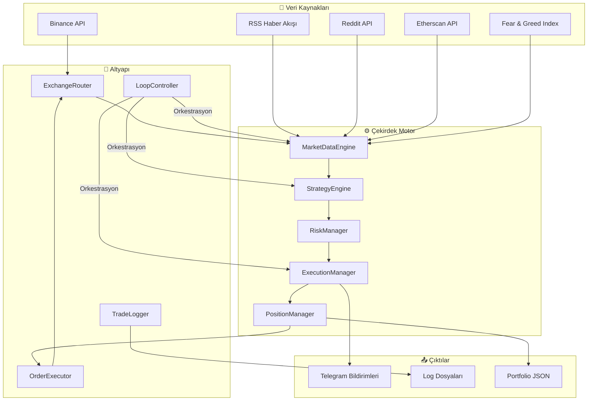

---

## 📁 Dosya Yapısı

| Dosya | Satır | Açıklama |
|-------|-------|----------|
| [main.py](file:///c:/Users/useit/15-10-proje/main.py) | 572 | Ana giriş noktası, tüm modülleri başlatır |
| [config.py](file:///c:/Users/useit/15-10-proje/config.py) | 380 | Merkezi konfigürasyon (60+ parametre) |
| [market_data_engine.py](file:///c:/Users/useit/15-10-proje/market_data_engine.py) | 1859 | Veri toplama ve işleme motoru |
| [strategy_engine.py](file:///c:/Users/useit/15-10-proje/strategy_engine.py) | 1597 | Karar motoru (Math + AI) |
| [execution_manager.py](file:///c:/Users/useit/15-10-proje/execution_manager.py) | 768 | İşlem yürütme yöneticisi |
| [loop_controller.py](file:///c:/Users/useit/15-10-proje/loop_controller.py) | 553 | Ana döngü orkestrasyonu |
| [position_manager.py](file:///c:/Users/useit/15-10-proje/position_manager.py) | 482 | SL/TP izleme ve pozisyon yönetimi |
| [risk_manager.py](file:///c:/Users/useit/15-10-proje/risk_manager.py) | 407 | Risk kontrolü ve pozisyon boyutlandırma |
| [exchange_router.py](file:///c:/Users/useit/15-10-proje/exchange_router.py) | 757 | Binance bağlantı yönetimi |
| [order_executor.py](file:///c:/Users/useit/15-10-proje/order_executor.py) | 665 | Emir oluşturma ve yürütme |
| [backtest.py](file:///c:/Users/useit/15-10-proje/backtest.py) | 576 | Geçmiş veri testi |
| [trade_logger.py](file:///c:/Users/useit/15-10-proje/trade_logger.py) | 387 | Merkezi loglama sistemi |
| [llm_utils.py](file:///c:/Users/useit/15-10-proje/llm_utils.py) | 361 | LLM yanıt ayrıştırma |
| [debug_suite.py](file:///c:/Users/useit/15-10-proje/debug_suite.py) | 1250 | Sistem diagnostik |

---

## 🔄 Ana İşlem Döngüsü

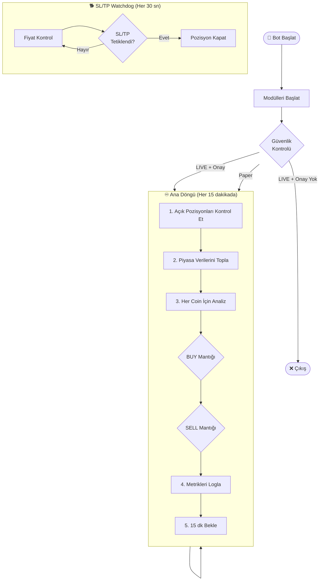

---

## 📊 Karar Verme Süreci

### Ağırlıklı Skor Modeli

Bot, **Math (60%)** ve **AI (40%)** bileşenlerini birleştiren hibrit bir karar sistemi kullanır:

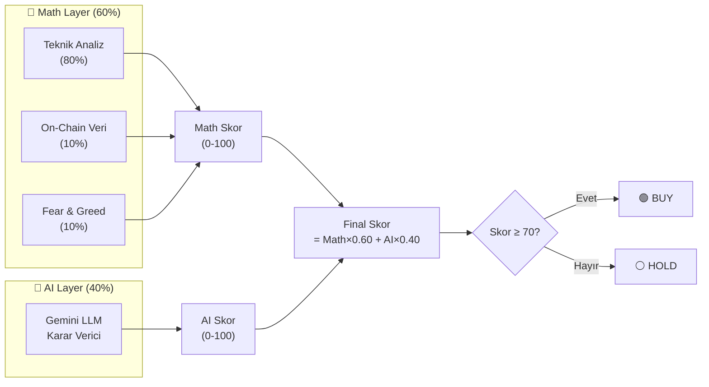

### BUY Karar Akışı

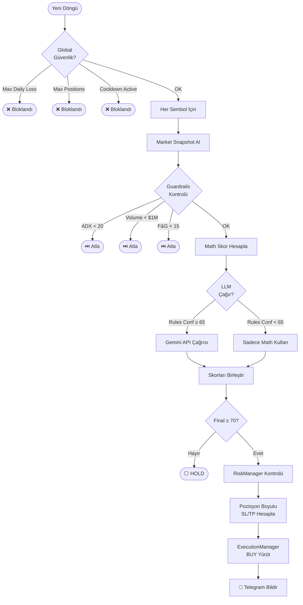

### SELL Karar Akışı

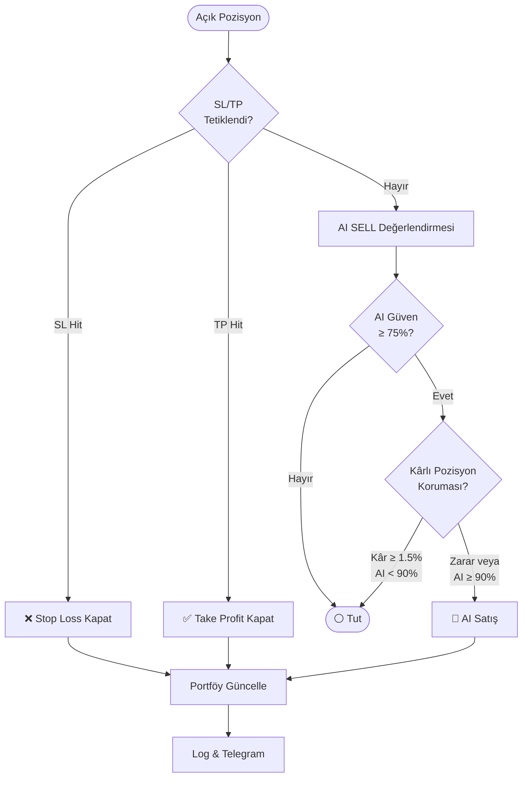

---

## 🔌 Modül Detayları

### 1. MarketDataEngine

Tüm dış veri kaynaklarından veri toplayan ve önbellekleyen merkezi veri motoru.

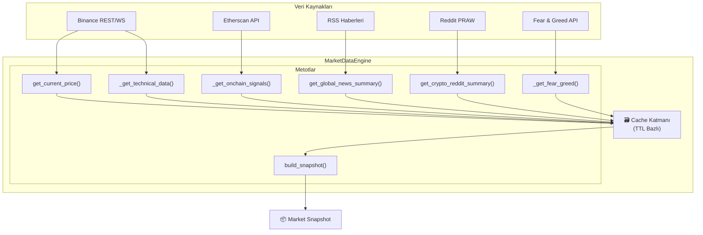

**Market Snapshot Yapısı:**
```python
{
    "symbol": "BTCUSDT",
    "price": 43500.0,
    "technical": {
        "rsi": 45.2,
        "macd": {"macd": 50, "signal": 45, "hist": 5},
        "ema": {"ema_50": 42000, "ema_200": 40000},
        "adx": 28.5,
        "atr": 1200.0,
        "volume_24h": 25000000000,
        "bb_upper": 44000,
        "bb_lower": 42000
    },
    "onchain": {
        "signal": "BULLISH",
        "whale_alert": False
    },
    "sentiment": {
        "fear_greed": {"value": 52, "classification": "Neutral"},
        "reddit_summary": "...",
        "news_summary": "..."
    }
}
```

---

### 2. StrategyEngine

Math + AI hibrit karar motoru.

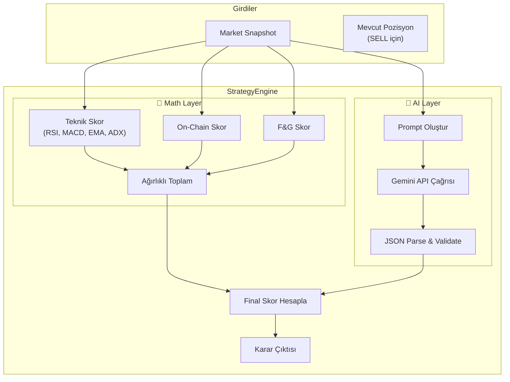

**Karar Çıktı Şeması:**
```python
{
    "action": "BUY" | "SELL" | "HOLD",
    "confidence": 75,  # 0-100
    "reason": "RSI oversold + positive MACD crossover",
    "metadata": {
        "math_score": 72,
        "ai_score": 78,
        "sl_bias": "neutral",
        "tp_bias": "neutral"
    }
}
```

---

### 3. RiskManager

Pozisyon boyutlandırma ve güvenlik kontrolleri.

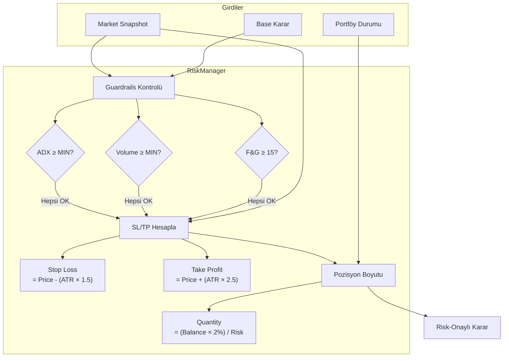

---

### 4. LoopController

Ana döngü orkestrasyonu ve alarm sistemi.

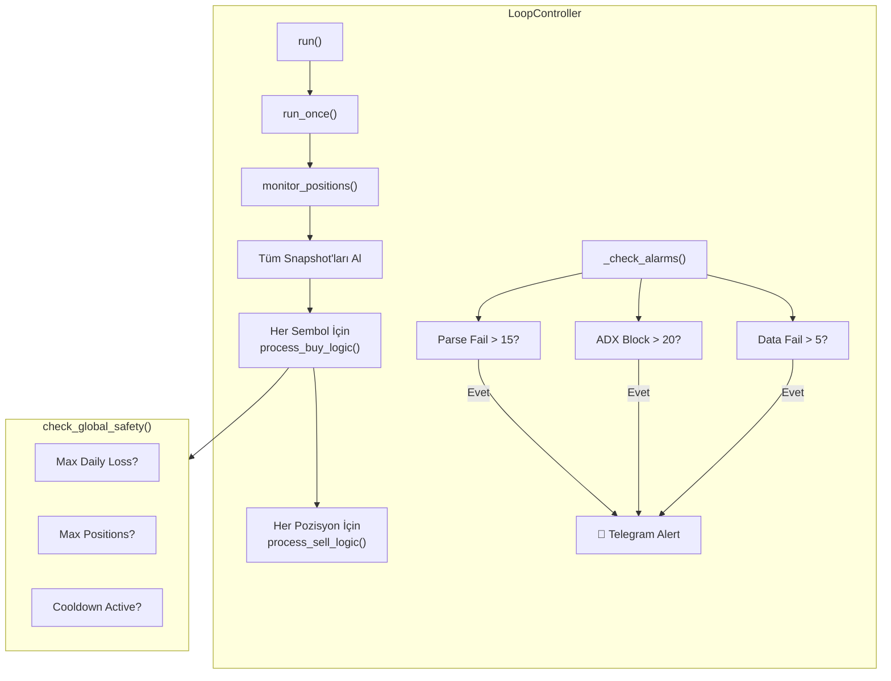

---

### 5. ExecutionManager

İşlem yürütme ve kayıt.

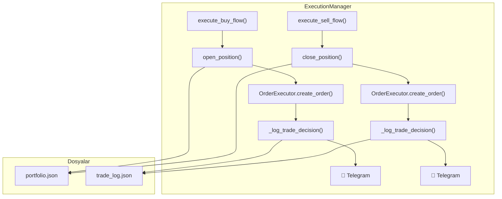

---

### 6. ExchangeRouter

WebSocket ve REST API bağlantı yönetimi.

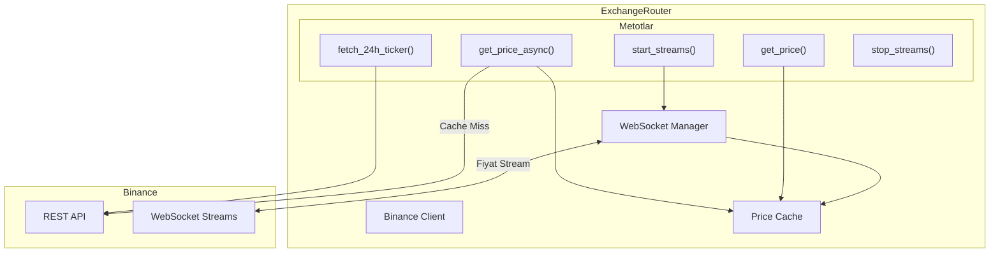

---

### 7. OrderExecutor

Emir oluşturma (Gerçek + Simülasyon).

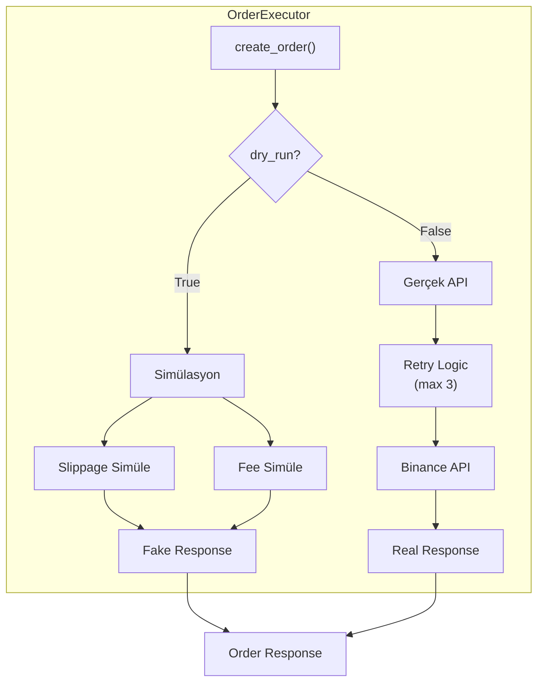

---

## ⚙️ Konfigürasyon Parametreleri

### 🔐 API Anahtarları (Zorunlu)

| Parametre | Açıklama |
|-----------|----------|
| `BINANCE_API_KEY` | Binance API anahtarı |
| `BINANCE_SECRET_KEY` | Binance gizli anahtar |
| `GEMINI_API_KEY` | Google Gemini AI API anahtarı |
| `TELEGRAM_BOT_TOKEN` | Telegram bot token |
| `TELEGRAM_CHAT_ID` | Telegram sohbet ID |

### 🔄 İşlem Modu

| Parametre | Varsayılan | Açıklama |
|-----------|------------|----------|
| `LIVE_TRADING` | `False` | `True` = Gerçek para ile işlem |
| `ALLOW_DANGEROUS_ACTIONS` | `False` | LIVE modda güvenlik kilidi |

### 🤖 AI Eşikleri

| Parametre | Varsayılan | Açıklama |
|-----------|------------|----------|
| `AI_TECH_CONFIDENCE_THRESHOLD` | 70 | BUY için minimum güven |
| `AI_NEWS_CONFIDENCE_THRESHOLD` | 70 | Haber analizi minimum güven |
| `AI_SELL_CONFIDENCE_THRESHOLD` | 75 | SELL için minimum güven |
| `USE_STRATEGY_LLM` | `True` | Strateji LLM aktif mi? |
| `STRATEGY_LLM_MODE` | `"always"` | `"always"` veya `"only_on_signal"` |
| `STRATEGY_LLM_MIN_RULES_CONF` | 65 | LLM çağrısı için minimum kural güveni |

### 📊 Ağırlıklar

| Parametre | Varsayılan | Açıklama |
|-----------|------------|----------|
| `STRATEGY_WEIGHT_MATH` | 0.60 | Math katmanı ağırlığı |
| `STRATEGY_WEIGHT_AI` | 0.40 | AI katmanı ağırlığı |
| `MATH_WEIGHT_TECHNICAL` | 0.80 | Teknik analiz ağırlığı |
| `MATH_WEIGHT_ONCHAIN` | 0.10 | On-chain veri ağırlığı |
| `MATH_WEIGHT_FNG` | 0.10 | Fear & Greed ağırlığı |

### 🛡️ Risk Kontrolleri

| Parametre | Varsayılan | Açıklama |
|-----------|------------|----------|
| `MAX_DAILY_LOSS_PCT` | 8.0% | Günlük maksimum kayıp |
| `MAX_OPEN_POSITIONS` | 5 | Maksimum açık pozisyon |
| `MAX_CONSECUTIVE_LOSSES` | 5 | Ardışık maksimum zarar |
| `COOLDOWN_MINUTES` | 60 | Zarar sonrası bekleme (dk) |
| `RISK_PER_TRADE` | 2.0% | İşlem başına maksimum risk |
| `MIN_VOLUME_GUARDRAIL` | $1M | Minimum 24h hacim |

### 📈 Teknik Eşikler

| Parametre | Varsayılan | Açıklama |
|-----------|------------|----------|
| `MIN_ADX_ENTRY` | 20.0 | Minimum ADX değeri |
| `MIN_ADX_ENTRY_SOFT` | 18.0 | Yüksek güvende yumuşatılmış ADX |
| `FNG_EXTREME_FEAR` | 15 | Extreme fear eşiği |

### 💰 Trading Ayarları

| Parametre | Varsayılan | Açıklama |
|-----------|------------|----------|
| `BASLANGIC_BAKIYE` | $1,000 | Paper trading başlangıç bakiyesi |
| `WATCHLIST` | BTC, ETH, SOL, BNB, XRP, AVAX, LINK | İzlenecek coinler |
| `LOOP_SECONDS` | 900 (15 dk) | Ana döngü süresi |

### 🔒 Kâr Koruma

| Parametre | Varsayılan | Açıklama |
|-----------|------------|----------|
| `PROTECT_PROFITABLE_POSITIONS` | `True` | Kârlı pozisyon koruması |
| `MIN_PROFIT_TO_PROTECT` | 1.5% | Koruma için minimum kâr |
| `AI_SELL_OVERRIDE_CONFIDENCE` | 90% | Korumayı geçen AI güveni |

### ⏱️ Cache & Timeout

| Parametre | Varsayılan | Açıklama |
|-----------|------------|----------|
| `CACHE_TTL_PRICE` | 1 sn | Fiyat cache süresi |
| `CACHE_TTL_TECH` | 15 sn | Teknik veri cache |
| `CACHE_TTL_SENTIMENT` | 90 sn | Sentiment cache |
| `CACHE_TTL_ONCHAIN` | 120 sn | On-chain cache |
| `API_TIMEOUT_DEFAULT` | 10 sn | Genel API timeout |

### 🐕 SL/TP Watchdog

| Parametre | Varsayılan | Açıklama |
|-----------|------------|----------|
| `SLTP_WATCHDOG_ENABLED` | `True` | Watchdog aktif mi? |
| `SLTP_WATCHDOG_INTERVAL_SEC` | 30 sn | Kontrol aralığı |

### 📱 Telegram Bildirimleri

| Parametre | Varsayılan | Açıklama |
|-----------|------------|----------|
| `TELEGRAM_NOTIFY_TRADES` | `True` | Trade bildirimleri |
| `TELEGRAM_NOTIFY_REDDIT` | `False` | Reddit sentiment |
| `TELEGRAM_NOTIFY_ONCHAIN` | `False` | Whale hareketleri |
| `TELEGRAM_NOTIFY_IMPORTANT_NEWS` | `False` | Önemli haberler |

---

## 📊 Veri Akış Diyagramı

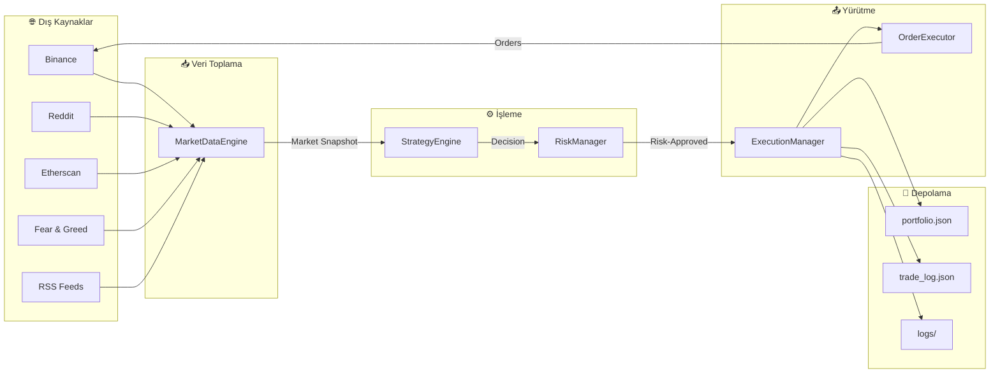

---

## 🧪 Yardımcı Araçlar

### Backtest Modülü

```python
from backtest import Backtester
import pandas as pd

# Geçmiş veri yükle
candles = pd.read_csv("btc_1h_2024.csv")

# Backtester başlat
bt = Backtester(candles, starting_balance=1000.0)

# Strateji engine ile test
await bt.run_backtest(strategy_engine, risk_manager)

# Sonuçları görüntüle
bt.print_summary()
```

### Debug Suite

```bash
# Tüm kontrolleri çalıştır
python debug_suite.py

# Sadece belirli kontroller
python debug_suite.py --check imports env binance

# Router testi dahil
python debug_suite.py --with-router
```

---

## 🚀 Hızlı Başlangıç

1. **Bağımlılıkları Kur:**
   ```bash
   pip install -r requirements.txt
   ```

2. **API Anahtarlarını Ayarla (`.env` dosyası):**
   ```env
   BINANCE_API_KEY=your_key
   BINANCE_SECRET_KEY=your_secret
   GEMINI_API_KEY=your_gemini_key
   TELEGRAM_BOT_TOKEN=your_bot_token
   TELEGRAM_CHAT_ID=your_chat_id
   ```

3. **Paper Trading Başlat:**
   ```bash
   python main.py
   ```

4. **(Opsiyonel) Live Trading:**
   ```env
   LIVE_TRADING=1
   ALLOW_DANGEROUS_ACTIONS=1
   ```

> [!CAUTION]
> Live Trading modunu aktifleştirmeden önce Paper Trading ile yeterli süre test yapın ve tüm risk parametrelerini dikkatlice ayarlayın.

---

## 📝 Özet Şeması

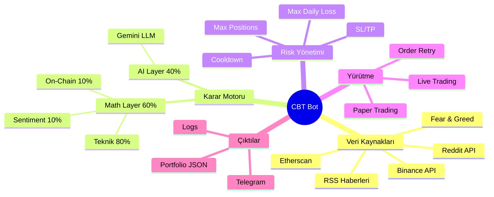

---

*Bu döküman, CBT projesi v1.0 için oluşturulmuştur. Son güncelleme: Aralık 2024*
